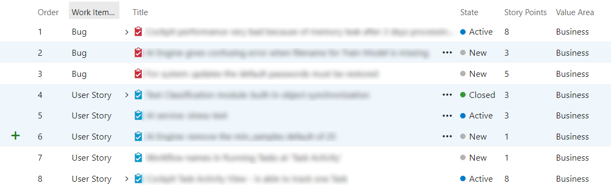

# Story Point counter for TFS

Chrome extension that calculates the total Story Points of all selected User Stories (rows) in the TFS backlog.

## Usage

First, use `CTRL` + `click` or `SHIFT` + `click` to select multiple User Stories (rows):

Now, click the extension's icon ("Count selected Story Points") to see the total amount of Story Points of the selected User Stories:

## Requirements

Created for in browser (Chrome) usage of Microsoft Visual Studio Team Foundation Server (Version 15).

## Installation

Install the extension from the Chrome Web Store:

- https://chrome.google.com/webstore/detail/story-point-counter-for-t/edkpofhcphipcgngadldadmfakgojjla.

Or install the extension manually (in *Developer mode*) by following the next steps:

1. Clone or download the **story-point-counter-tfs** repository;
2. In Chrome, go to `chrome://extensions/`;
3. Turn on *Developer mode*;
4. Click on the *Load unpacked* button;
5. Point to the **story-point-counter-tfs** folder and click OK.

  

## Current limitations

Only works if the Story Points column is your fifth column. 

Also, make sure all User Stories (rows) you want to count are visible, otherwise they might be ignored. When you scroll rows out of sight, TFS removes the rows from the DOM and there Story Points are no longer accessible.

Currently not available in the Chrome Web Store, so it can only be installed in Chrome's *Developer mode*. 